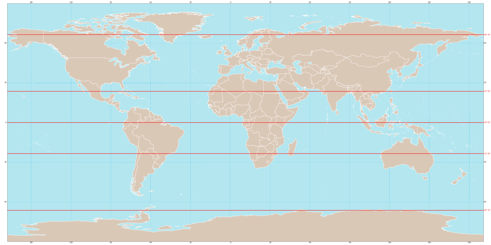

## Latitude

### Overview
A regular expression for Latitude for use as a profiling indicator in Talend.
### Details
Complements the pattern for Longitude that ships with Talend Studio.
### Images

### Install Instructions
Go to Talend's profiling perspective. Right click on Libraries. Click Import to import the Latitude.zip file from Talend Exchange. 

#### Release Notes

##### 7.2 - 2019-10-30 22:29:31
Based on the regular expression availble at http://regexlib.com/UserPatterns.aspx?authorId=9e80e16d-38e6-41da-ac94-8a1f37e84953. 
### Compatible
 -7.2