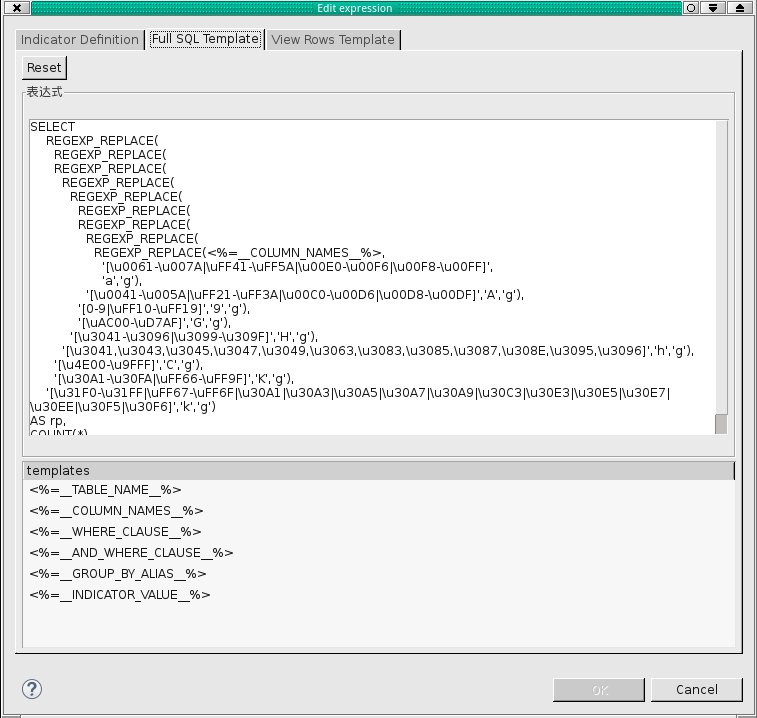

## Pattern frequency count on postgreSQL

### Overview
This user defined indicator can compute pattern frequencies for both latin and Eastern Asian characters on postgreSQL 
### Details
More details please refer to: https://jira.talendforge.org/browse/TDQ-10690 and https://help.talend.com/display/KBSTAGING/Add+customized+character+pattern+matching+support+in+pattern+frequency+indicator+on+postgreSQL
### Images

### Install Instructions
Download the zip and install it in Data Quality studio by importing it from toolbar.

#### Release Notes

##### 1.0 - 2015-11-10 10:27:33

### Compatible
 -  5.4 (obsolete)
 -   5.5 (obsolete)
 -   5.6 (obsolete)
 -   6.0 (obsolete)
 -   6.1 (obsolete)
 -   6.2 (obsolete)
 - 7.2
 - 7.3
 - 8.0