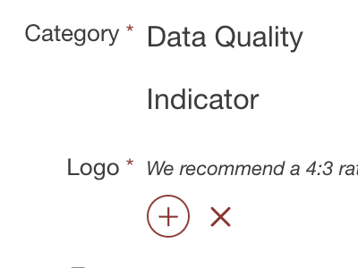

# Data Quality
 * <a href='./archive/Chris Klaus/components/Latitude/readme.md'> Latitude</a> by <a href='./archive/Chris Klaus/readme.md'>Chris Klaus</a> :white_check_mark: Compatible with Talend 7.x / 8.x  - 2019-10-30 :arrow_heading_down: 11
 * <a href='./archive/gpegliasco/components/Pyramids of ages/readme.md'> Pyramids of ages</a> by <a href='./archive/gpegliasco/readme.md'>gpegliasco</a> :warning: Compatibility not known - 2016-04-01 :arrow_heading_down: 17
 * <a href='./archive/Azerml/components/TestDQindicator/readme.md'> TestDQindicator</a> by <a href='./archive/Azerml/readme.md'>Azerml</a> :white_check_mark: Compatible with Talend 7.x / 8.x  - 2020-03-27 :arrow_heading_down: 9
 * <a href='./archive/qiongli/components/testDQPattern/readme.md'> testDQPattern</a> by <a href='./archive/qiongli/readme.md'>qiongli</a> :white_check_mark: Compatible with Talend 7.x / 8.x  - 2021-06-02 :arrow_heading_down: 4

# Data Quality Indicator
 * <a href='./archive/yyi/components/Average Length For SQL Server Storing Large/readme.md'> Average Length For SQL Server Storing Large</a> by <a href='./archive/yyi/readme.md'>yyi</a> :warning: Compatibility not known - 2012-06-12 :arrow_heading_down: 151
 * <a href='./archive/mzhao/components/Average Length For SQL Server Storing Large/readme.md'> Average Length For SQL Server Storing Large</a> by <a href='./archive/mzhao/readme.md'>mzhao</a> :warning: Compatibility not known - 2012-08-17 :arrow_heading_down: 150
 * <a href='./archive/mzhao/components/BenfordLawFrequencyIndicator/readme.md'> BenfordLawFrequencyIndicator</a> by <a href='./archive/mzhao/readme.md'>mzhao</a> :warning: Compatibility not known - 2012-10-15 :arrow_heading_down: 76
 * <a href='./archive/scorreia/components/Duplicate Rows/readme.md'> Duplicate Rows</a> by <a href='./archive/scorreia/readme.md'>scorreia</a> :white_check_mark: Compatible with Talend 7.x / 8.x  - 2013-04-25 :arrow_heading_down: 419
 * <a href='./archive/mzhao/components/EMail validation via mail server/readme.md'> EMail validation via mail server</a> by <a href='./archive/mzhao/readme.md'>mzhao</a> :warning: Compatibility not known - 2013-03-01 :arrow_heading_down: 90
 * <a href='./archive/mzhao/components/EMail validation via mail server/readme.md'> EMail validation via mail server</a> by <a href='./archive/mzhao/readme.md'>mzhao</a> :warning: Compatibility not known - 2013-03-01 :arrow_heading_down: 98
 * <a href='./archive/mzhao/components/EMail validation via mail server/readme.md'> EMail validation via mail server</a> by <a href='./archive/mzhao/readme.md'>mzhao</a> :warning: Compatibility not known - 2013-03-01 :arrow_heading_down: 72
 * <a href='./archive/scorreia/components/email_indicator/readme.md'> email_indicator</a> by <a href='./archive/scorreia/readme.md'>scorreia</a> :white_check_mark: Compatible with Talend 7.x / 8.x  - 2013-04-24 :arrow_heading_down: 120
 * <a href='./archive/scorreia/components/Frequency table of hours/readme.md'> Frequency table of hours</a> by <a href='./archive/scorreia/readme.md'>scorreia</a> :white_check_mark: Compatible with Talend 7.x / 8.x  - 2013-04-25 :arrow_heading_down: 149
 * <a href='./archive/scorreia/components/ISO Week Number Frequency/readme.md'> ISO Week Number Frequency</a> by <a href='./archive/scorreia/readme.md'>scorreia</a> :white_check_mark: Compatible with Talend 7.x / 8.x  - 2013-04-08 :arrow_heading_down: 95
 * <a href='./archive/scorreia/components/Length Range Frequency/readme.md'> Length Range Frequency</a> by <a href='./archive/scorreia/readme.md'>scorreia</a> :white_check_mark: Compatible with Talend 7.x / 8.x  - 2013-04-25 :arrow_heading_down: 115
 * <a href='./archive/mzhao/components/Maximal Length For SQL Server Storing Large/readme.md'> Maximal Length For SQL Server Storing Large</a> by <a href='./archive/mzhao/readme.md'>mzhao</a> :warning: Compatibility not known - 2012-08-17 :arrow_heading_down: 76
 * <a href='./archive/yyi/components/Maximal Length For SQL Server Storing Large/readme.md'> Maximal Length For SQL Server Storing Large</a> by <a href='./archive/yyi/readme.md'>yyi</a> :warning: Compatibility not known - 2012-06-13 :arrow_heading_down: 74
 * <a href='./archive/yyi/components/Minimal Length For SQL Server Storing Large/readme.md'> Minimal Length For SQL Server Storing Large</a> by <a href='./archive/yyi/readme.md'>yyi</a> :warning: Compatibility not known - 2012-06-13 :arrow_heading_down: 80
 * <a href='./archive/mzhao/components/Minimal Length For SQL Server Storing Large/readme.md'> Minimal Length For SQL Server Storing Large</a> by <a href='./archive/mzhao/readme.md'>mzhao</a> :warning: Compatibility not known - 2012-08-17 :arrow_heading_down: 80
 * <a href='./archive/scorreia/components/Not Trimmed Text/readme.md'> Not Trimmed Text</a> by <a href='./archive/scorreia/readme.md'>scorreia</a> :warning: Compatibility not known - 2010-04-19 :arrow_heading_down: 282
 * <a href='./archive/scorreia/components/Order of Magnitude/readme.md'> Order of Magnitude</a> by <a href='./archive/scorreia/readme.md'>scorreia</a> :warning: Compatibility not known - 2013-04-25 :arrow_heading_down: 129
 * <a href='./archive/mzhao/components/Pattern frequency count on postgreSQL/readme.md'> Pattern frequency count on postgreSQL</a> by <a href='./archive/mzhao/readme.md'>mzhao</a> :white_check_mark: Compatible with Talend 7.x / 8.x  - 2015-11-10 :arrow_heading_down: 18
 * <a href='./archive/scorreia/components/phone_area_code_freq/readme.md'> phone_area_code_freq</a> by <a href='./archive/scorreia/readme.md'>scorreia</a> :white_check_mark: Compatible with Talend 7.x / 8.x  - 2013-04-24 :arrow_heading_down: 87
 * <a href='./archive/scorreia/components/Sample Standard Deviation/readme.md'> Sample Standard Deviation</a> by <a href='./archive/scorreia/readme.md'>scorreia</a> :white_check_mark: Compatible with Talend 7.x / 8.x  - 2013-04-25 :arrow_heading_down: 204
 * <a href='./archive/scorreia/components/Standard Deviation (rounded)/readme.md'> Standard Deviation (rounded)</a> by <a href='./archive/scorreia/readme.md'>scorreia</a> :warning: Compatibility not known - 2010-03-23 :arrow_heading_down: 107
 * <a href='./archive/scorreia/components/Trimmed/readme.md'> Trimmed</a> by <a href='./archive/scorreia/readme.md'>scorreia</a> :white_check_mark: Compatible with Talend 7.x / 8.x  - 2013-04-25 :arrow_heading_down: 122
 * <a href='./archive/scorreia/components/udi_average_yearly_income/readme.md'> udi_average_yearly_income</a> by <a href='./archive/scorreia/readme.md'>scorreia</a> :white_check_mark: Compatible with Talend 7.x / 8.x  - 2013-04-24 :arrow_heading_down: 66
 * <a href='./archive/xqliu/components/UDI_Count/readme.md'> UDI_Count</a> by <a href='./archive/xqliu/readme.md'>xqliu</a> :warning: Compatibility not known - 2012-09-25 :arrow_heading_down: 73
 * <a href='./archive/mzhao/components/udi_for_test_merge/readme.md'> udi_for_test_merge</a> by <a href='./archive/mzhao/readme.md'>mzhao</a> :warning: Compatibility not known - 2013-02-04 :arrow_heading_down: 51
 * <a href='./archive/scorreia/components/US_customers_count/readme.md'> US_customers_count</a> by <a href='./archive/scorreia/readme.md'>scorreia</a> :white_check_mark: Compatible with Talend 7.x / 8.x  - 2013-04-24 :arrow_heading_down: 69
 * <a href='./archive/scorreia/components/Variance/readme.md'> Variance</a> by <a href='./archive/scorreia/readme.md'>scorreia</a> :white_check_mark: Compatible with Talend 7.x / 8.x  - 2013-04-25 :arrow_heading_down: 111
 * <a href='./archive/scorreia/components/Week Frequency/readme.md'> Week Frequency</a> by <a href='./archive/scorreia/readme.md'>scorreia</a> :warning: Compatibility not known - 2013-04-25 :arrow_heading_down: 111

# Data Quality ParserRule
 * <a href='./archive/mzhao/components/parser_rule_for_merge/readme.md'> parser_rule_for_merge</a> by <a href='./archive/mzhao/readme.md'>mzhao</a> :warning: Compatibility not known - 2013-02-04 :arrow_heading_down: 64
 * <a href='./archive/mzhao/components/ParserRuleDemoXmi/readme.md'> ParserRuleDemoXmi</a> by <a href='./archive/mzhao/readme.md'>mzhao</a> :warning: Compatibility not known - 2013-02-01 :arrow_heading_down: 71
 * <a href='./archive/scorreia/components/test parser rule/readme.md'> test parser rule</a> by <a href='./archive/scorreia/readme.md'>scorreia</a> :warning: Compatibility not known - 2011-09-01 :arrow_heading_down: 141
 * <a href='./archive/scorreia/components/Tweets/readme.md'> Tweets</a> by <a href='./archive/scorreia/readme.md'>scorreia</a> :white_check_mark: Compatible with Talend 7.x / 8.x  - 2013-11-20 :arrow_heading_down: 236

# Data Quality Regex
 * <a href='./archive/mhallam/components/10 Digit US Phone Number/readme.md'> 10 Digit US Phone Number</a> by <a href='./archive/mhallam/readme.md'>mhallam</a> :warning: Compatibility not known - 2009-07-07 :arrow_heading_down: 74
 * <a href='./archive/scorreia/components/Acronyms/readme.md'> Acronyms</a> by <a href='./archive/scorreia/readme.md'>scorreia</a> :warning: Compatibility not known - 2011-02-09 :arrow_heading_down: 278
 * <a href='./archive/mhallam/components/Austria VAT Number/readme.md'> Austria VAT Number</a> by <a href='./archive/mhallam/readme.md'>mhallam</a> :warning: Compatibility not known - 2014-07-29 :arrow_heading_down: 59
 * <a href='./archive/mhallam/components/Bank Routing Transit Number (RTN)/readme.md'> Bank Routing Transit Number (RTN)</a> by <a href='./archive/mhallam/readme.md'>mhallam</a> :warning: Compatibility not known - 2014-07-29 :arrow_heading_down: 56
 * <a href='./archive/mhallam/components/Bulgaria Vat Number/readme.md'> Bulgaria Vat Number</a> by <a href='./archive/mhallam/readme.md'>mhallam</a> :warning: Compatibility not known - 2014-07-29 :arrow_heading_down: 42
 * <a href='./archive/mhallam/components/Companies House/readme.md'> Companies House</a> by <a href='./archive/mhallam/readme.md'>mhallam</a> :warning: Compatibility not known - 2014-07-29 :arrow_heading_down: 56
 * <a href='./archive/mhallam/components/Complex Australian Phone Number/readme.md'> Complex Australian Phone Number</a> by <a href='./archive/mhallam/readme.md'>mhallam</a> :warning: Compatibility not known - 2014-07-29 :arrow_heading_down: 54
 * <a href='./archive/scorreia/components/Correctly Encoded Characters/readme.md'> Correctly Encoded Characters</a> by <a href='./archive/scorreia/readme.md'>scorreia</a> :warning: Compatibility not known - 2013-01-30 :arrow_heading_down: 91
 * <a href='./archive/mhallam/components/Currency 16,3/readme.md'> Currency 16,3</a> by <a href='./archive/mhallam/readme.md'>mhallam</a> :warning: Compatibility not known - 2014-07-29 :arrow_heading_down: 41
 * <a href='./archive/mhallam/components/Date  DD MM YYYY/readme.md'> Date  DD MM YYYY</a> by <a href='./archive/mhallam/readme.md'>mhallam</a> :warning: Compatibility not known - 2009-07-06 :arrow_heading_down: 194
 * <a href='./archive/wmj007/components/Date DD MM YYYY/readme.md'> Date DD MM YYYY</a> by <a href='./archive/wmj007/readme.md'>wmj007</a> :warning: Compatibility not known - 2011-10-10 :arrow_heading_down: 115
 * <a href='./archive/mhallam/components/Date DD MMM/readme.md'> Date DD MMM</a> by <a href='./archive/mhallam/readme.md'>mhallam</a> :warning: Compatibility not known - 2009-07-06 :arrow_heading_down: 37
 * <a href='./archive/mhallam/components/Date DD MMM YYYY/readme.md'> Date DD MMM YYYY</a> by <a href='./archive/mhallam/readme.md'>mhallam</a> :warning: Compatibility not known - 2009-07-06 :arrow_heading_down: 73
 * <a href='./archive/mhallam/components/Date MM DD YY/readme.md'> Date MM DD YY</a> by <a href='./archive/mhallam/readme.md'>mhallam</a> :warning: Compatibility not known - 2009-07-06 :arrow_heading_down: 42
 * <a href='./archive/mhallam/components/Date MM DD YYYY/readme.md'> Date MM DD YYYY</a> by <a href='./archive/mhallam/readme.md'>mhallam</a> :warning: Compatibility not known - 2009-07-06 :arrow_heading_down: 55
 * <a href='./archive/mhallam/components/daysOfWeek/readme.md'> daysOfWeek</a> by <a href='./archive/mhallam/readme.md'>mhallam</a> :warning: Compatibility not known - 2014-07-29 :arrow_heading_down: 37
 * <a href='./archive/scorreia/components/delimited file format/readme.md'> delimited file format</a> by <a href='./archive/scorreia/readme.md'>scorreia</a> :warning: Compatibility not known - 2011-05-17 :arrow_heading_down: 137
 * <a href='./archive/fcweeber/components/Dutch Phone Number/readme.md'> Dutch Phone Number</a> by <a href='./archive/fcweeber/readme.md'>fcweeber</a> :warning: Compatibility not known - 2014-05-26 :arrow_heading_down: 56
 * <a href='./archive/fcweeber/components/Dutch Postal Code/readme.md'> Dutch Postal Code</a> by <a href='./archive/fcweeber/readme.md'>fcweeber</a> :warning: Compatibility not known - 2014-05-26 :arrow_heading_down: 58
 * <a href='./archive/fcweeber/components/Dutch VAT Number/readme.md'> Dutch VAT Number</a> by <a href='./archive/fcweeber/readme.md'>fcweeber</a> :warning: Compatibility not known - 2011-12-19 :arrow_heading_down: 83
 * <a href='./archive/scorreia/components/Email Address (with list of top-level domains)/readme.md'> Email Address (with list of top-level domains)</a> by <a href='./archive/scorreia/readme.md'>scorreia</a> :warning: Compatibility not known - 2012-06-19 :arrow_heading_down: 384
 * <a href='./archive/mzhao/components/Email Address (with list of top-level domains)/readme.md'> Email Address (with list of top-level domains)</a> by <a href='./archive/mzhao/readme.md'>mzhao</a> :warning: Compatibility not known - 2014-05-26 :arrow_heading_down: 183
 * <a href='./archive/scorreia/components/Empty Text/readme.md'> Empty Text</a> by <a href='./archive/scorreia/readme.md'>scorreia</a> :warning: Compatibility not known - 2010-04-19 :arrow_heading_down: 110
 * <a href='./archive/mzhao/components/EmptyTextForTest/readme.md'> EmptyTextForTest</a> by <a href='./archive/mzhao/readme.md'>mzhao</a> :warning: Compatibility not known - 2013-02-04 :arrow_heading_down: 55
 * <a href='./archive/geomatilux/components/Extract or Validate an Email Address/readme.md'> Extract or Validate an Email Address</a> by <a href='./archive/geomatilux/readme.md'>geomatilux</a> :warning: Compatibility not known - 2013-01-28 :arrow_heading_down: 255
 * <a href='./archive/mhallam/components/FR Phone Number (International)/readme.md'> FR Phone Number (International)</a> by <a href='./archive/mhallam/readme.md'>mhallam</a> :warning: Compatibility not known - 2009-07-03 :arrow_heading_down: 70
 * <a href='./archive/mhallam/components/FR Phone Number (local or international)/readme.md'> FR Phone Number (local or international)</a> by <a href='./archive/mhallam/readme.md'>mhallam</a> :warning: Compatibility not known - 2009-07-03 :arrow_heading_down: 69
 * <a href='./archive/scorreia/components/FR Phone Number (parenthesis allowed)/readme.md'> FR Phone Number (parenthesis allowed)</a> by <a href='./archive/scorreia/readme.md'>scorreia</a> :white_check_mark: Compatible with Talend 7.x / 8.x  - 2014-05-26 :arrow_heading_down: 76
 * <a href='./archive/scorreia/components/French date/readme.md'> French date</a> by <a href='./archive/scorreia/readme.md'>scorreia</a> :warning: Compatibility not known - 2009-02-25 :arrow_heading_down: 141
 * <a href='./archive/scorreia/components/French phone number/readme.md'> French phone number</a> by <a href='./archive/scorreia/readme.md'>scorreia</a> :warning: Compatibility not known - 2009-02-09 :arrow_heading_down: 92
 * <a href='./archive/scorreia/components/French Social Security number/readme.md'> French Social Security number</a> by <a href='./archive/scorreia/readme.md'>scorreia</a> :warning: Compatibility not known - 2009-02-09 :arrow_heading_down: 91
 * <a href='./archive/scorreia/components/French VAT number/readme.md'> French VAT number</a> by <a href='./archive/scorreia/readme.md'>scorreia</a> :warning: Compatibility not known - 2009-02-09 :arrow_heading_down: 120
 * <a href='./archive/scorreia/components/Gender/readme.md'> Gender</a> by <a href='./archive/scorreia/readme.md'>scorreia</a> :warning: Compatibility not known - 2009-02-09 :arrow_heading_down: 143
 * <a href='./archive/mhallam/components/German phone Number (international or local ) /readme.md'> German phone Number (international or local ) </a> by <a href='./archive/mhallam/readme.md'>mhallam</a> :warning: Compatibility not known - 2009-07-03 :arrow_heading_down: 76
 * <a href='./archive/mhallam/components/German phone Number (international) /readme.md'> German phone Number (international) </a> by <a href='./archive/mhallam/readme.md'>mhallam</a> :warning: Compatibility not known - 2009-07-03 :arrow_heading_down: 51
 * <a href='./archive/mhallam/components/German phone Number (local) /readme.md'> German phone Number (local) </a> by <a href='./archive/mhallam/readme.md'>mhallam</a> :warning: Compatibility not known - 2009-07-03 :arrow_heading_down: 65
 * <a href='./archive/fadoe/components/German postal code match/readme.md'> German postal code match</a> by <a href='./archive/fadoe/readme.md'>fadoe</a> :warning: Compatibility not known - 2014-07-29 :arrow_heading_down: 44
 * <a href='./archive/scorreia/components/Hex Color Codes/readme.md'> Hex Color Codes</a> by <a href='./archive/scorreia/readme.md'>scorreia</a> :warning: Compatibility not known - 2009-02-25 :arrow_heading_down: 83
 * <a href='./archive/mhallam/components/hh:mm/readme.md'> hh:mm</a> by <a href='./archive/mhallam/readme.md'>mhallam</a> :warning: Compatibility not known - 2014-07-29 :arrow_heading_down: 38
 * <a href='./archive/scorreia/components/Home Row Text (Random Text)/readme.md'> Home Row Text (Random Text)</a> by <a href='./archive/scorreia/readme.md'>scorreia</a> :warning: Compatibility not known - 2009-07-03 :arrow_heading_down: 55
 * <a href='./archive/mhallam/components/hour24/readme.md'> hour24</a> by <a href='./archive/mhallam/readme.md'>mhallam</a> :warning: Compatibility not known - 2014-07-29 :arrow_heading_down: 30
 * <a href='./archive/scorreia/components/Initial(s)/readme.md'> Initial(s)</a> by <a href='./archive/scorreia/readme.md'>scorreia</a> :warning: Compatibility not known - 2011-02-09 :arrow_heading_down: 160
 * <a href='./archive/scorreia/components/Initials/readme.md'> Initials</a> by <a href='./archive/scorreia/readme.md'>scorreia</a> :warning: Compatibility not known - 2011-02-08 :arrow_heading_down: 155
 * <a href='./archive/mhallam/components/International Passport/readme.md'> International Passport</a> by <a href='./archive/mhallam/readme.md'>mhallam</a> :warning: Compatibility not known - 2014-07-29 :arrow_heading_down: 57
 * <a href='./archive/mhallam/components/International phone number/readme.md'> International phone number</a> by <a href='./archive/mhallam/readme.md'>mhallam</a> :warning: Compatibility not known - 2009-07-07 :arrow_heading_down: 107
 * <a href='./archive/scorreia/components/IP Address/readme.md'> IP Address</a> by <a href='./archive/scorreia/readme.md'>scorreia</a> :warning: Compatibility not known - 2009-03-09 :arrow_heading_down: 340
 * <a href='./archive/scorreia/components/IP Address/readme.md'> IP Address</a> by <a href='./archive/scorreia/readme.md'>scorreia</a> :warning: Compatibility not known - 2009-03-09 :arrow_heading_down: 91
 * <a href='./archive/mhallam/components/ISBN Checker/readme.md'> ISBN Checker</a> by <a href='./archive/mhallam/readme.md'>mhallam</a> :warning: Compatibility not known - 2014-07-29 :arrow_heading_down: 62
 * <a href='./archive/mhallam/components/Istat Code/readme.md'> Istat Code</a> by <a href='./archive/mhallam/readme.md'>mhallam</a> :warning: Compatibility not known - 2014-07-29 :arrow_heading_down: 37
 * <a href='./archive/mhallam/components/Linuw path Verify/readme.md'> Linuw path Verify</a> by <a href='./archive/mhallam/readme.md'>mhallam</a> :warning: Compatibility not known - 2009-07-06 :arrow_heading_down: 44
 * <a href='./archive/mhallam/components/Longitude Validation/readme.md'> Longitude Validation</a> by <a href='./archive/mhallam/readme.md'>mhallam</a> :warning: Compatibility not known - 2014-07-29 :arrow_heading_down: 42
 * <a href='./archive/mhallam/components/Minutes Seconds/readme.md'> Minutes Seconds</a> by <a href='./archive/mhallam/readme.md'>mhallam</a> :white_check_mark: Compatible with Talend 7.x / 8.x  - 2014-05-26 :arrow_heading_down: 43
 * <a href='./archive/mhallam/components/minutes59/readme.md'> minutes59</a> by <a href='./archive/mhallam/readme.md'>mhallam</a> :warning: Compatibility not known - 2010-01-27 :arrow_heading_down: 58
 * <a href='./archive/mhallam/components/Mobile number of India/readme.md'> Mobile number of India</a> by <a href='./archive/mhallam/readme.md'>mhallam</a> :warning: Compatibility not known - 2009-07-07 :arrow_heading_down: 54
 * <a href='./archive/mhallam/components/MonthName/readme.md'> MonthName</a> by <a href='./archive/mhallam/readme.md'>mhallam</a> :warning: Compatibility not known - 2014-07-29 :arrow_heading_down: 46
 * <a href='./archive/mhallam/components/Mysql datetime/readme.md'> Mysql datetime</a> by <a href='./archive/mhallam/readme.md'>mhallam</a> :warning: Compatibility not known - 2010-01-27 :arrow_heading_down: 144
 * <a href='./archive/scorreia/components/Names with unicode characters/readme.md'> Names with unicode characters</a> by <a href='./archive/scorreia/readme.md'>scorreia</a> :warning: Compatibility not known - 2014-05-26 :arrow_heading_down: 69
 * <a href='./archive/mhallam/components/No special chart/readme.md'> No special chart</a> by <a href='./archive/mhallam/readme.md'>mhallam</a> :warning: Compatibility not known - 2009-07-07 :arrow_heading_down: 54
 * <a href='./archive/mhallam/components/number1-10/readme.md'> number1-10</a> by <a href='./archive/mhallam/readme.md'>mhallam</a> :warning: Compatibility not known - 2010-01-27 :arrow_heading_down: 54
 * <a href='./archive/scorreia/components/Numeric/readme.md'> Numeric</a> by <a href='./archive/scorreia/readme.md'>scorreia</a> :warning: Compatibility not known - 2009-08-12 :arrow_heading_down: 403
 * <a href='./archive/dcortinovis/components/Only alphabetical characters not empty/readme.md'> Only alphabetical characters not empty</a> by <a href='./archive/dcortinovis/readme.md'>dcortinovis</a> :white_check_mark: Compatible with Talend 7.x / 8.x  - 2013-06-19 :arrow_heading_down: 138
 * <a href='./archive/mzhao/components/pattern_for_test_merge/readme.md'> pattern_for_test_merge</a> by <a href='./archive/mzhao/readme.md'>mzhao</a> :warning: Compatibility not known - 2013-02-04 :arrow_heading_down: 58
 * <a href='./archive/mhallam/components/Phone Brazil/readme.md'> Phone Brazil</a> by <a href='./archive/mhallam/readme.md'>mhallam</a> :warning: Compatibility not known - 2009-07-07 :arrow_heading_down: 83
 * <a href='./archive/mhallam/components/phone number/readme.md'> phone number</a> by <a href='./archive/mhallam/readme.md'>mhallam</a> :warning: Compatibility not known - 2009-07-03 :arrow_heading_down: 94
 * <a href='./archive/mhallam/components/Postal code or Pin code of India/readme.md'> Postal code or Pin code of India</a> by <a href='./archive/mhallam/readme.md'>mhallam</a> :warning: Compatibility not known - 2009-07-03 :arrow_heading_down: 48
 * <a href='./archive/scorreia/components/Properties keys/readme.md'> Properties keys</a> by <a href='./archive/scorreia/readme.md'>scorreia</a> :warning: Compatibility not known - 2009-02-25 :arrow_heading_down: 72
 * <a href='./archive/scorreia/components/Properties keys/readme.md'> Properties keys</a> by <a href='./archive/scorreia/readme.md'>scorreia</a> :warning: Compatibility not known - 2009-02-25 :arrow_heading_down: 96
 * <a href='./archive/mhallam/components/Quarter/readme.md'> Quarter</a> by <a href='./archive/mhallam/readme.md'>mhallam</a> :warning: Compatibility not known - 2010-01-27 :arrow_heading_down: 51
 * <a href='./archive/scorreia/components/Random email/readme.md'> Random email</a> by <a href='./archive/scorreia/readme.md'>scorreia</a> :warning: Compatibility not known - 2014-07-29 :arrow_heading_down: 57
 * <a href='./archive/scorreia/components/Random Text/readme.md'> Random Text</a> by <a href='./archive/scorreia/readme.md'>scorreia</a> :warning: Compatibility not known - 2009-02-20 :arrow_heading_down: 172
 * <a href='./archive/scorreia/components/Regular Text/readme.md'> Regular Text</a> by <a href='./archive/scorreia/readme.md'>scorreia</a> :white_check_mark: Compatible with Talend 7.x / 8.x  - 2014-05-26 :arrow_heading_down: 63
 * <a href='./archive/scorreia/components/Repeated Character/readme.md'> Repeated Character</a> by <a href='./archive/scorreia/readme.md'>scorreia</a> :warning: Compatibility not known - 2014-05-26 :arrow_heading_down: 42
 * <a href='./archive/mhallam/components/semester/readme.md'> semester</a> by <a href='./archive/mhallam/readme.md'>mhallam</a> :warning: Compatibility not known - 2010-01-27 :arrow_heading_down: 39
 * <a href='./archive/scorreia/components/Starts with blank/readme.md'> Starts with blank</a> by <a href='./archive/scorreia/readme.md'>scorreia</a> :warning: Compatibility not known - 2010-04-19 :arrow_heading_down: 169
 * <a href='./archive/scorreia/components/Starts with spaces/readme.md'> Starts with spaces</a> by <a href='./archive/scorreia/readme.md'>scorreia</a> :warning: Compatibility not known - 2010-04-19 :arrow_heading_down: 147
 * <a href='./archive/mhallam/components/Swedish Personal Nr (Personnummer)/readme.md'> Swedish Personal Nr (Personnummer)</a> by <a href='./archive/mhallam/readme.md'>mhallam</a> :warning: Compatibility not known - 2014-07-29 :arrow_heading_down: 52
 * <a href='./archive/mhallam/components/Swedish personnummer with accepted foreigners/readme.md'> Swedish personnummer with accepted foreigners</a> by <a href='./archive/mhallam/readme.md'>mhallam</a> :warning: Compatibility not known - 2014-07-29 :arrow_heading_down: 32
 * <a href='./archive/mhallam/components/Swiss Zip Code validation/readme.md'> Swiss Zip Code validation</a> by <a href='./archive/mhallam/readme.md'>mhallam</a> :warning: Compatibility not known - 2009-07-03 :arrow_heading_down: 61
 * <a href='./archive/scorreia/components/Temperature in Celsius/readme.md'> Temperature in Celsius</a> by <a href='./archive/scorreia/readme.md'>scorreia</a> :white_check_mark: Compatible with Talend 7.x / 8.x  - 2014-08-18 :arrow_heading_down: 57
 * <a href='./archive/scorreia/components/Text/readme.md'> Text</a> by <a href='./archive/scorreia/readme.md'>scorreia</a> :white_check_mark: Compatible with Talend 7.x / 8.x  - 2014-05-26 :arrow_heading_down: 59
 * <a href='./archive/mhallam/components/Time 24:00 hrs format/readme.md'> Time 24:00 hrs format</a> by <a href='./archive/mhallam/readme.md'>mhallam</a> :warning: Compatibility not known - 2009-07-06 :arrow_heading_down: 61
 * <a href='./archive/mhallam/components/UK Vehicle Registration Plate Number Plate/readme.md'> UK Vehicle Registration Plate Number Plate</a> by <a href='./archive/mhallam/readme.md'>mhallam</a> :warning: Compatibility not known - 2014-07-29 :arrow_heading_down: 50
 * <a href='./archive/scorreia/components/Unaccented Words/readme.md'> Unaccented Words</a> by <a href='./archive/scorreia/readme.md'>scorreia</a> :white_check_mark: Compatible with Talend 7.x / 8.x  - 2014-05-26 :arrow_heading_down: 49
 * <a href='./archive/scorreia/components/US Phone number/readme.md'> US Phone number</a> by <a href='./archive/scorreia/readme.md'>scorreia</a> :warning: Compatibility not known - 2009-02-25 :arrow_heading_down: 214
 * <a href='./archive/mhallam/components/US Zipcode Validation/readme.md'> US Zipcode Validation</a> by <a href='./archive/mhallam/readme.md'>mhallam</a> :warning: Compatibility not known - 2009-07-07 :arrow_heading_down: 105
 * <a href='./archive/mhallam/components/Valid UK Post Codes Upper and Lower Case/readme.md'> Valid UK Post Codes Upper and Lower Case</a> by <a href='./archive/mhallam/readme.md'>mhallam</a> :warning: Compatibility not known - 2009-07-07 :arrow_heading_down: 130
 * <a href='./archive/mhallam/components/website validator/readme.md'> website validator</a> by <a href='./archive/mhallam/readme.md'>mhallam</a> :warning: Compatibility not known - 2009-07-06 :arrow_heading_down: 81
 * <a href='./archive/scorreia/components/Words/readme.md'> Words</a> by <a href='./archive/scorreia/readme.md'>scorreia</a> :white_check_mark: Compatible with Talend 7.x / 8.x  - 2014-05-26 :arrow_heading_down: 61

# Data Quality SQL
 * <a href='./archive/sizhaoliu/components/Email (test only)/readme.md'> Email (test only)</a> by <a href='./archive/sizhaoliu/readme.md'>sizhaoliu</a> :warning: Compatibility not known - 2012-12-17 :arrow_heading_down: 78
 * <a href='./archive/mzhao/components/Email_xmi/readme.md'> Email_xmi</a> by <a href='./archive/mzhao/readme.md'>mzhao</a> :warning: Compatibility not known - 2013-02-01 :arrow_heading_down: 161
 * <a href='./archive/scorreia/components/hotmail email/readme.md'> hotmail email</a> by <a href='./archive/scorreia/readme.md'>scorreia</a> :warning: Compatibility not known - 2014-05-26 :arrow_heading_down: 85
 * <a href='./archive/vstoyak/components/tOracleObjectList/readme.md'> tOracleObjectList</a> by <a href='./archive/vstoyak/readme.md'>vstoyak</a> :warning: Compatibility not known - 2011-11-17 :arrow_heading_down: 112